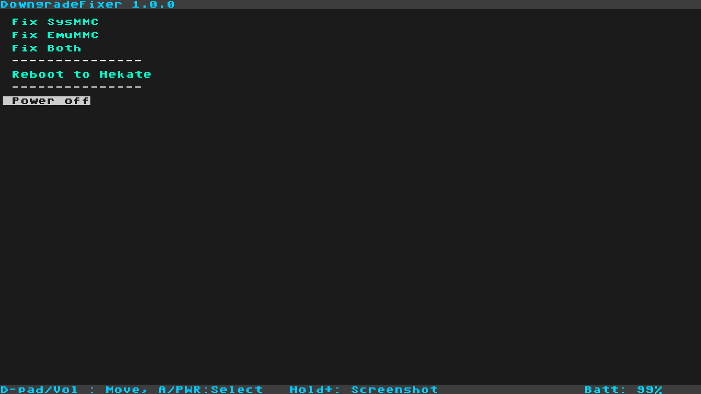
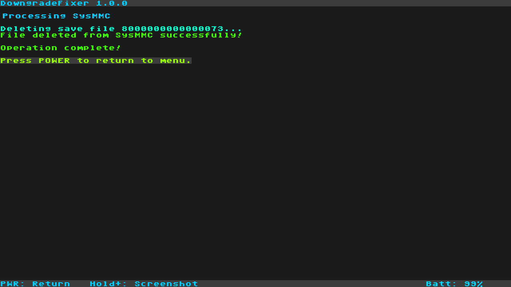

# DowngradeFixer

<p align="center">
  
</p>

<p align="center">
  
</p>

DowngradeFixer is a streamlined bare-metal payload designed to fix issues encountered when downgrading Nintendo Switch firmware from 21.0.0 to 20.5.0. It performs two critical operations without booting into Horizon OS.

> **Based on** [Lockpick_RCM_Pro](https://github.com/sthetixofficial/Lockpick_RCM_Pro) by sthetix
> **Originally based on** [Lockpick_RCMaster](https://github.com/THZoria/Lockpick_RCMaster) by THZoria

## What It Does

DowngradeFixer automates two essential steps needed after downgrading your Nintendo Switch firmware:

1. **Dumps prod.keys** - Extracts encryption keys required for various homebrew tools
2. **Deletes file `8000000000000073`** - Removes the problematic save file from the SYSTEM partition that can cause issues after downgrading

## Usage

1. Download the zip file in the release page, extract it to the sd card

2. Launch Hekate, click Payloads, then select `DowngradeFixer.bin` 

3. Select **"Fix Downgrade"** from the main menu, then choose:
   - **Fix SysNAND only** - Process only the system NAND
   - **Fix EmuNAND only** - Process only the emulated NAND (if available)
   - **Fix Both** - Process both SysNAND and EmuNAND

4. The payload will silently:
   - Derive encryption keys and save prod.keys to `/switch/prod.keys`
   - Use those keys to access the encrypted SYSTEM partition
   - Delete the file `8000000000000073` from the SYSTEM/save partition
   - Display the results for each step

5. Reboot using one of the menu options:
   - **Reboot to Hekate** - Boots `bootloader/update.bin` if present
   - **Power off** - Safely powers down the console

## Features

- **Automated Fix** - Performs both key dumping and file deletion in one operation
- **Silent Key Derivation** - Keys are derived and saved without verbose output
- **Flexible NAND Selection** - Choose to fix SysNAND, EmuNAND, or both
- **Safe Operation** - Validates each step and reports status
- **No Horizon OS Required** - Runs as a bare-metal payload for maximum compatibility
- **Multiple Reboot Options** - Launch Hekate, custom payload, or power off

## When to Use This

Use DowngradeFixer when:
- You've downgraded your Nintendo Switch firmware from higher firmware e.g.22.1.0 to 20.5.0


## Building

1. Install [devkitARM](https://devkitpro.org/).
2. Run:
   ```
   make release
   ```

## Important Notes

- **Backup First**: Always keep backups of your NAND and important files
- **One Purpose**: This tool is specifically designed for the downgrade fix process
- **Clean Operation**: Only performs the two essential operations - no extras

## License

DowngradeFixer is licensed under the **GPLv2**. The save processing module is adapted from [hactool](https://github.com/SciresM/hactool), licensed under ISC.

## Credits and Attribution

This project is a streamlined version built upon:
- **[sthetix](https://github.com/sthetix/Lockpick_RCM_Pro)** - Lockpick_RCM_Pro
- **[THZoria](https://github.com/THZoria/Lockpick_RCMaster)** - Lockpick_RCMaster base
- **[shchmue](https://github.com/shchmue)** - Original Lockpick_RCM
- **[CTCaer](https://github.com/CTCaer/hekate)** - Hekate bootloader and libraries
- **[Atmosphere-NX](https://github.com/Atmosphere-NX/Atmosphere)** - Falcon keygen
- **ReSwitched community** - Development support

## Disclaimer

This tool is for educational and legitimate backup purposes only. The authors are not responsible for any damage or data loss. Use at your own risk.


## Support My Work

If you find this project useful, please consider supporting me by buying me a coffee!

<a href="https://www.buymeacoffee.com/sthetixofficial" target="_blank">
  
</a>
